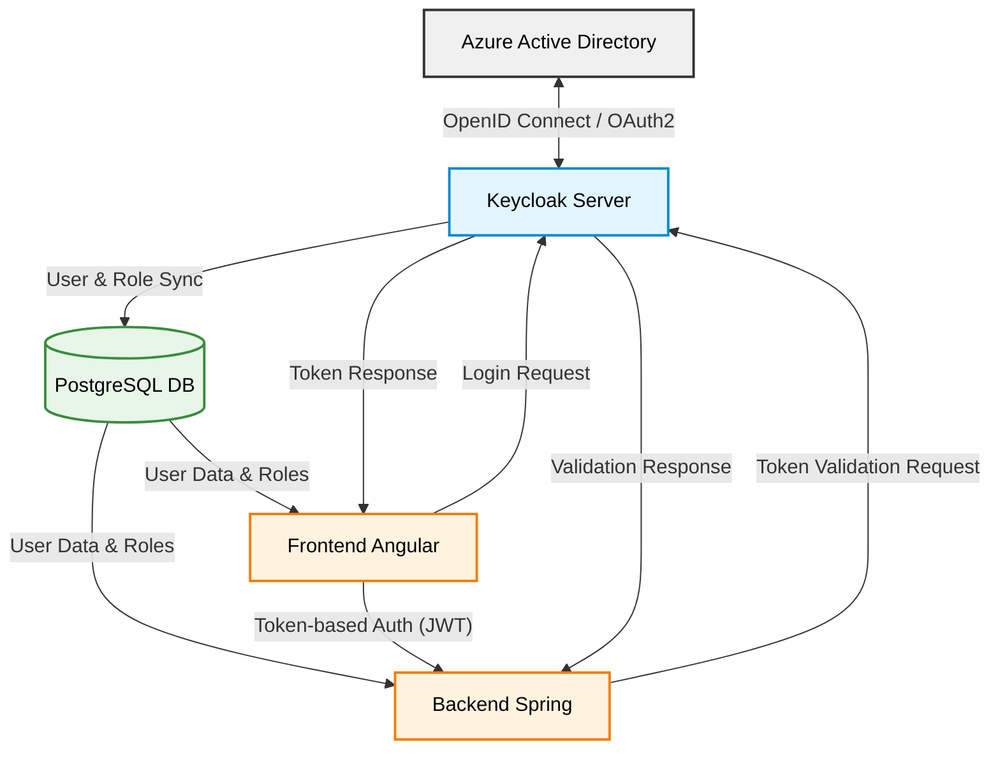
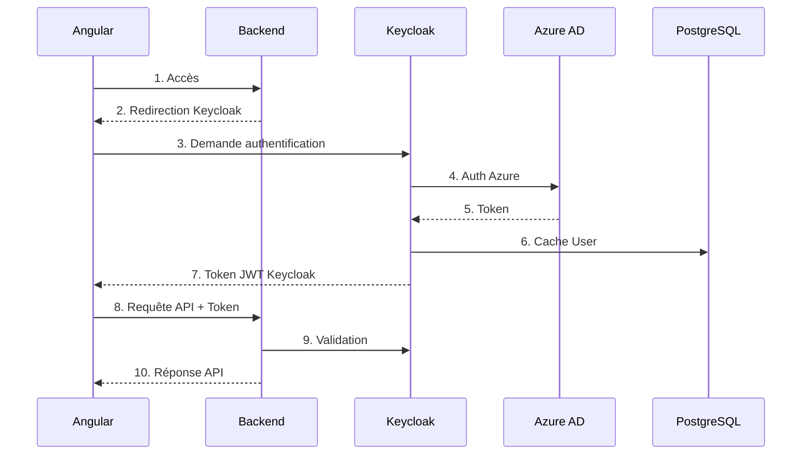
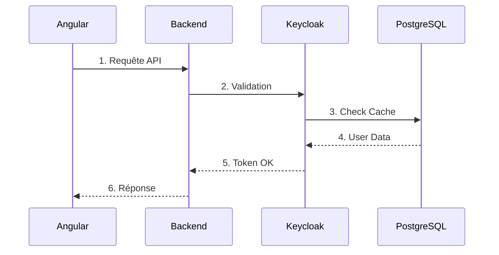
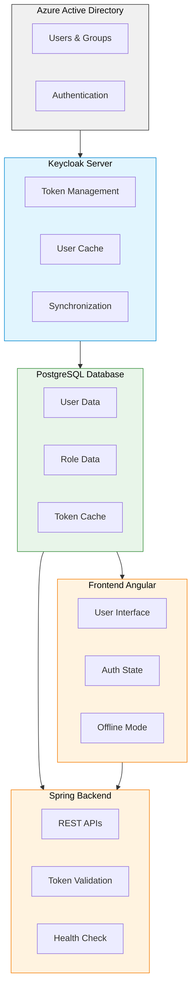

# CCCP13 AUTH SERVICE

# Architecture:

Mode Online:
1. L'utilisateur se connecte via Azure AD
2. Keycloak valide avec Azure AD et génère un token
3. Le token est utilisé pour toutes les requêtes API

Mode Offline:
1. Les tokens et profils sont mis en cache
2. Authentication locale via Keycloak
3. Synchronisation périodique avec Azure AD

## Flux d'authentification détaillé:

### Mode Online:

### Mode Offline:

## Composants principaux:

1. **Azure Active Directory**
   - Fournisseur d'identité principal (IdP)
   - Gestion des utilisateurs et groupes
   - Authentification primaire

2. **Keycloak Server**
   - Serveur d'authentification intermédiaire
   - Gestion des tokens et sessions
   - Cache des profils utilisateurs
   - Mode de fonctionnement hybride (online/offline)

3. **PostgreSQL Database**
   - Stockage persistant pour Keycloak
   - Cache des utilisateurs et rôles
   - Réplication pour la haute disponibilité

4. **Frontend Angular**
   - Interface utilisateur moderne
   - Gestion du state de connexion
   - Support du mode hors ligne
   - Composants réutilisables pour l'authentification

5. **Backend Spring**
   - API REST sécurisées
   - Validation des tokens
   - Support du mode dégradé
   - Monitoring et métriques

## Composants et flux de données:

## Stratégie de résilience:

1. **Mise en cache**
   - Tokens d'authentification
   - Profils utilisateurs
   - Rôles et permissions

2. **Synchronisation**
   - Périodique avec Azure AD
   - Réplication de la base PostgreSQL
   - Export régulier des données critiques

3. **Haute disponibilité**
   - Cluster Keycloak
   - Base de données répliquée
   - Monitoring continu

# Configuration de Keycloak avec Azure AD

## Étape 1: Configuration côté Azure AD

1. Connectez-vous au [portail Azure](https://portal.azure.com/)
2. Accédez à "Azure Active Directory" > "Inscriptions d'applications" > "Nouvelle inscription"
3. Nommez l'application (ex: "CCCP13-Keycloak-Integration")
4. Définissez l'URI de redirection (Web): `https://[votre-serveur-keycloak]/auth/realms/CCCP13/broker/azuread/endpoint`
5. Cliquez sur "Enregistrer" et notez l'ID d'application (client) et le répertoire (tenant) ID
6. Sous "Certificats et secrets", créez un nouveau secret client et notez sa valeur
7. Sous "Autorisations API", ajoutez les autorisations Microsoft Graph suivantes:
   - User.Read (déléguée)
   - Directory.Read.All (déléguée)
   - OpenId permissions, email, profile

## Étape 2: Configuration de Keycloak

### Création du Realm CCCP13

1. Accédez à la console d'administration de Keycloak (`https://[votre-serveur-keycloak]/auth/admin`)
2. Créez un nouveau realm nommé "CCCP13"

### Configuration du fournisseur d'identité Azure AD

1. Dans le realm CCCP13, accédez à "Identity Providers" > "Add provider" > "OpenID Connect v1.0"
2. Configurez les paramètres:
   - Alias: `azuread`
   - Display Name: `Microsoft Office 365`
   - Discovery URL: `https://login.microsoftonline.com/{tenant-id}/v2.0/.well-known/openid-configuration`
   - Client ID: `{votre-client-id-azure}`
   - Client Secret: `{votre-client-secret-azure}`
   - Scope: `openid email profile`
   - Prompt: `login`
   
3. Dans "Advanced Settings":
   - Store Tokens: `ON` permet de réutiliser les token d'auth pendant la durée de validité sans avoir à questioner azure AD
   - Stored Tokens Readable: `OFF` normalement déjà OFF par défaut, il permet de ne pas les store en clair
   - Sync Mode: `force` update les info de l'user depuis AD à chaque connection

### Configuration du mode Failover

1. Accédez à "Realm Settings" > "Cache Policy"
2. Configurez "Default Max Lifespan of User Cache" à une valeur élevée (ex: 72 heures)
3. Dans "Authentication" > "Flows" > "Browser", modifiez le flow pour permettre les modes de fallback

## Étape 3: Configuration de la stratégie de maintien du service en cas de panne

1. Créez un script de synchronisation périodique:
   - Ajoutez une tâche planifiée qui exporte régulièrement les utilisateurs et rôles
   - Configurez une réplication de la base de données PostgreSQL

2. Configuration de haute disponibilité:
   - Déployez Keycloak en cluster
   - Mettez en place une réplication de la base de données

3. Configuration du mode dégradé:
   - Ajoutez une règle dans les flux d'authentification pour permettre l'authentification locale quand Azure n'est pas disponible 

### Limitations:
 - Les users doivent se connecter au moins une fois avant d'être ajouté sur la base keycloak, cependant il est possible de rajouter un script de synchro périodique plus tard
