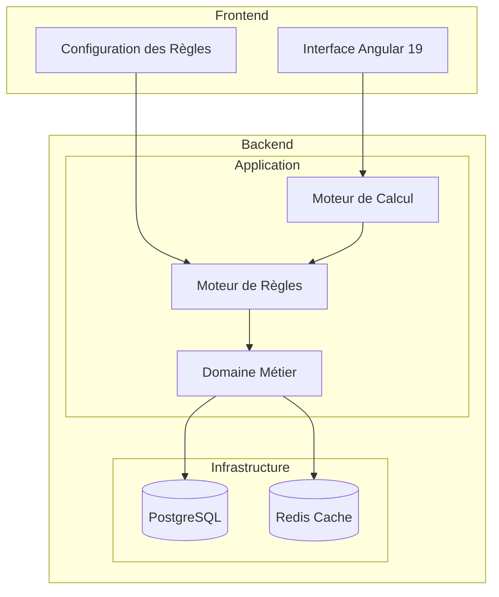

# Architecture du Projet

## Vue d'ensemble
L'application suit une architecture en couches avec une séparation claire entre le frontend et le backend.

## Architecture Technique



## Backend (Spring Boot)

### Structure des Packages
```
com.cccp13.docker.salary
├── domain
│   ├── model          # Entités et DTOs
│   ├── repository     # Interfaces des repositories
│   ├── service        # Logique métier
│   └── exception      # Exceptions personnalisées
├── infrastructure
│   ├── persistence    # Implémentation des repositories
│   ├── config         # Configuration Spring
│   └── security       # Configuration de sécurité
└── application
    ├── controller     # Contrôleurs REST
    └── dto            # DTOs pour les requêtes/réponses
```

### Composants Principaux
1. **Domain Layer**
   - Modèles : Docker, WorkShift, WorkSite, CargoType, SalaryCalculation
   - Services : SalaryCalculationService, RuleEvaluationService
   - Repositories : DockerRepository, WorkShiftRepository, etc.

2. **Infrastructure Layer**
   - Configuration de la base de données PostgreSQL
   - Configuration du cache Redis
   - Implémentation des repositories

3. **Application Layer**
   - Contrôleurs REST pour chaque entité
   - Gestion des requêtes HTTP
   - Transformation DTO/Entité

## Frontend (Angular)

### Structure des Dossiers
```
salary-app/
├── src/
│   ├── app/
│   │   ├── components/     # Composants Angular
│   │   ├── services/       # Services Angular
│   │   ├── models/         # Interfaces TypeScript
│   │   ├── shared/         # Composants partagés
│   │   └── app.module.ts   # Module principal
│   ├── assets/            # Ressources statiques
│   └── environments/      # Configuration par environnement
```

### Composants Principaux
1. **Pages**
   - Docker List/Form
   - Work Shift List/Form
   - Salary Calculation
   - Statistics

2. **Services**
   - DockerService
   - WorkShiftService
   - SalaryCalculationService
   - StatisticsService

3. **Shared Components**
   - NavBar
   - DataTable
   - Form Components

## Flux de Données
1. L'utilisateur interagit avec l'interface Angular
2. Les composants Angular appellent les services appropriés
3. Les services font des requêtes HTTP au backend
4. Les contrôleurs Spring Boot traitent les requêtes
5. Les services métier exécutent la logique
6. Les repositories interagissent avec la base de données
7. Les réponses remontent la chaîne jusqu'à l'interface utilisateur

## Sécurité
- Authentification JWT
- Autorisation basée sur les rôles
- Protection CSRF
- Validation des entrées

## Performance
- Mise en cache avec Redis pour les calculs de salaires peut être intéressant selon les volumes de données
- Pagination des résultats
- Optimisation des requêtes SQL
- Lazy loading des modules Angular

## Tests
- Tests unitaires (JUnit 5)
- Tests d'intégration
- Tests E2E (Cypress)
- Tests de composants Angular
